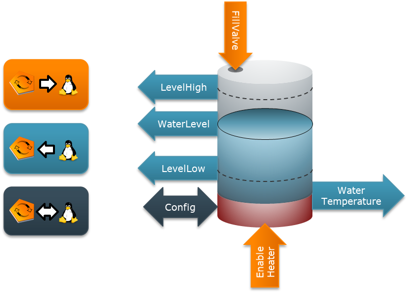

# exOS-Samples
Sample applications for exOS Technology Package

This repository contains samples that can be used for educational / testing purposes. 
The intention of the samples is to give the user an understanding of how the same 
exOS application is built using different languages / templates.

---

## WaterTank

The WaterTank sample showcases an imaginary water tank which runs in Linux and is controlled from Automation Runtime.
It includes sending and receiving of structures (using the Status and Config structures), receiving cyclic data from
Linux and measuring the latency of the data exchanged. It is therefore a simple way to check basic connectivity, and
check the synchronization between AR and Linux.

All Samples are found in the `WaterTank` folder and are available as binary or source components. Binary components
can be deployed from any system, source components require a build environment to be configured (for example, in [WSL](https://github.com/br-automation-com/exOS-WSL))

### Application description

In Automation Studio, the WaterTank is controlled via the `WaterTankCyclic_0` function block (handling the datamodel connection),
and the `WaterTank_0` structure for exchanging the actual WaterTank data.

The application works in a way that after having established a connection (via `Enable` on the `WaterTankCyclic_0` function
block), a simulated WaterTank is started on Linux as soon as the datamodel enters `Operational` state (via the `Start` input
on the function block). Once the WaterTank datamodel is `Operational`, data is exchanged between the systems (via the `WaterTank_0` 
structure), for example, opening the `FillValve` will increase the `Status.WaterLevel` and so on. 

